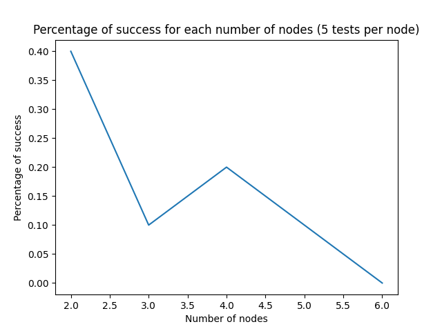
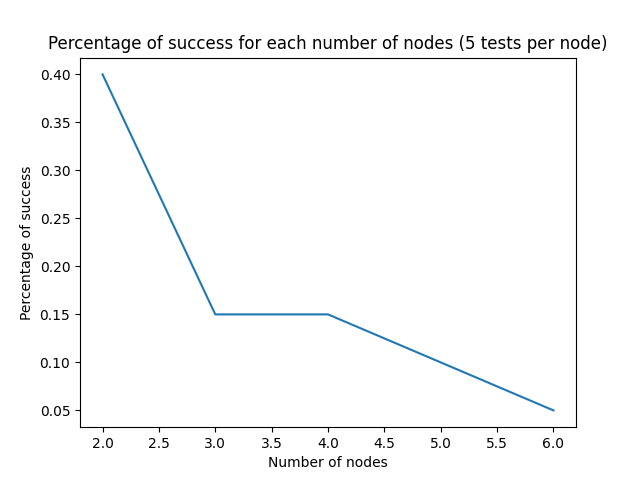
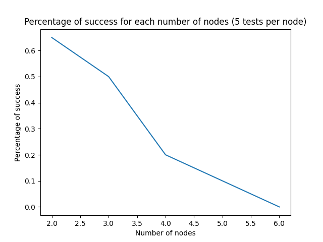

# Archive des fichiers

🗂️ /AutomatasGenerator contient l'ensemble des fichiers de génération d'automate et de prompt engeenering.

🗂️ /Results contient les figures générées par les scripts.

🗂️ /Tests contient des tests additionels

## promptengeenering.py

Ce script permet de tester la qualité d'un prompt engeenering. Il prend en entrée un fichier .txt contenant le prompt engeenering et génère des automates pour observer le pourcentage de réussite.

## Résultats intermédiaires

NB: Le nombre de tests par noeud est en réalité de 20. Le titre du graphe est éronné, je le changerai plus tard.

Techniques utilisées issues de https://www.promptingguide.ai/techniques

Résultats de réussite avec le prompt first_prompt_QandA.txt

Résultats de réussite avec le prompt first_prompt_QandA2.txt

Résultats de réussite avec le prompt first_prompt_generateKnowledge.txt

